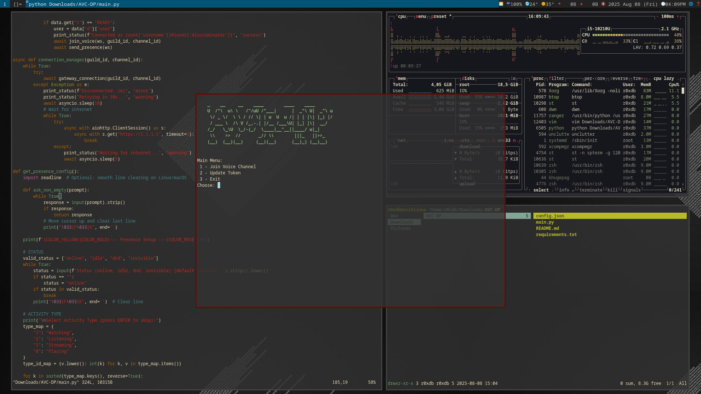

````markdown
# AVC-DP

Just a small project that’s definitely **not magic** — it won’t make you hear audio or talk.  
No hype, no flex, just some simple Discord stuff running with your own token.  
If it does something useful for you, that’s already enough.

```bash
git clone https://github.com/r0xdeadbeef/AVC-DP.git && \
cd AVC-DP && \
pip install -r requirements.txt && \
python3 main.py
````

---


```

